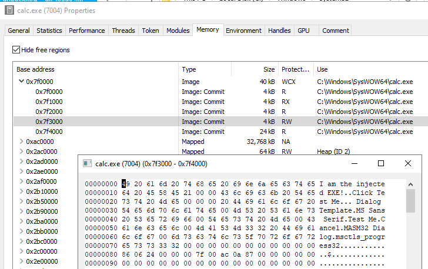

# Process Overwriting

[](https://ci.appveyor.com/project/hasherezade/process-overwriting)

Process Overwriting is a PE injection technique, closely related to [Process Hollowing](https://github.com/hasherezade/libpeconv/tree/master/run_pe) and [Module Overloading](https://github.com/hasherezade/module_overloading).

With its help, you can replace the main executable (not a DLL) of the target process.

It works only for a newly created process - injection to existing processes is not supported with this technique.

WARNING: The size of the target image must be NOT SMALLER than the size of the payload image.

Steps taken:

1. creates a suspended process from a benign file (with CFG disabled)
2. maps the payload in memory, and writes it over the originally mapped image (without unmapping of the original image)
3. updates the entry point of the process to the entry point of the payload
4. resumes the process, executing the replaced PE

> [!IMPORTANT]  
> [Read FAQ](https://github.com/hasherezade/process_overwriting/wiki)

Demo:
-

The demo payload ([`demo.bin`](https://github.com/hasherezade/process_overwriting/blob/master/demo.bin)) injected into Windows Calc (default target):


In memory (via Process Hacker):



📹 Process Overwriting on Windows 11 24H2: https://youtu.be/sZ8tMwKfvXw

Clone:
-
Use recursive clone to get the repo together with all the submodules:
```console
git clone --recursive https://github.com/hasherezade/process_overwriting.git
```
